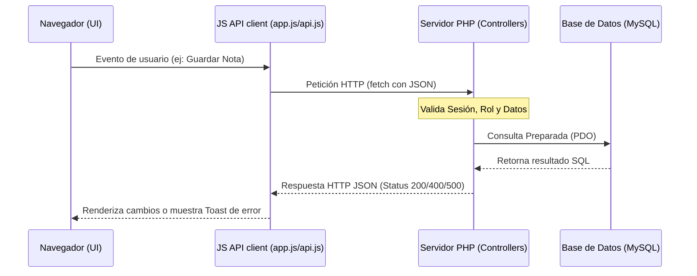

# SAII — Contexto Técnico de la Etapa Backend

Este documento sirve como marco teórico y directriz de integración para la transición del sistema **SAII (Sistema Administrativo del Instituto de Informática)** de un prototipo con datos simulados (mock) en memoria a una aplicación con backend real y persistencia en base de datos.

---

## 1. Estado Actual del Frontend

El frontend del sistema SAII se encuentra completado e interactivo. Reside en el directorio `public/`:
* `public/index.html` — Estructura HTML del panel administrativo de único archivo (SPA simulado).
* `public/css/styles.css` — Estilos institucionales personalizados (incluyendo toggle de modo claro/oscuro y diseño adaptable).
* `public/js/data.js` — Base de datos simulada en memoria (`mockData`) y gestor de datos síncronos (`DataManager`).
* `public/js/app.js` — Lógica de la aplicación administrativa (`SAIIApp`) que gestiona el renderizado de vistas, modales, manipulación del DOM y bindings de eventos.

### Limitaciones del Estado Actual:
1. **Volatilidad:** Los cambios en alumnos, grupos, asistencia y notas se pierden al recargar la página (salvo el idioma y el tema que persisten en `localStorage`).
2. **Seguridad Nula:** Las credenciales de acceso están expuestas en texto plano en `data.js` y el login es meramente cosmético.
3. **Funciones Rotas en el Frontend (Identificadas en Auditoría):**
   * El botón "Imprimir" del modal de certificados llama a `printCertificate()` que no existe globalmente.
   * El botón "Descargar PDF" del modal de certificados llama a `downloadCertificatePDF()` que no existe globalmente.
   * Los botones de descarga en la visualización de reportes llaman a `app.exportReportSimulated()` el cual no está implementado en `app.js`.
   * Existen controles HTML para la vista docente de asistencia que llaman a `app.showAdminAttendanceList()`, `app.loadAttendanceByDate()` y `app.markAllPresent()` que no existen en el controlador `app.js`.

---

## 2. Objetivo del Backend

El objetivo principal de la etapa backend es dotar al sistema SAII de una arquitectura **Cliente-Servidor** real:
* **Persistencia de Datos:** Almacenar de forma estructurada e íntegra toda la información en un motor de base de datos relacional.
* **Seguridad y Control de Accesos:** Validar credenciales mediante hash seguro en el servidor y administrar roles a través de variables de sesión seguras de PHP.
* **Validación en el Servidor:** Impedir que datos corruptos o incompletos (DNI duplicados, notas fuera de rango de 0-20, matrículas excedidas) se guarden en la base de datos, repitiendo y reforzando las validaciones del cliente.

---

## 3. Stack Tecnológico Elegido

* **Lenguaje Backend:** PHP 8.0 o superior (Vanilla PHP).
* **Base de Datos:** MySQL / MariaDB (versión 10.4+).
* **Entorno de Desarrollo Local:** XAMPP (servidor web Apache + MySQL + intérprete PHP).
* **Gestor de BD:** phpMyAdmin (interfaz web incluida en XAMPP).
* **Controlador de Acceso a BD:** PDO (PHP Data Objects) con consultas preparadas.

### Justificación de la Elección:
1. **Estándar Académico:** XAMPP y PHP + MySQL son el stack predeterminado y obligatorio en el plan de estudios de la **Facultad de Ingeniería Industrial de la Universidad Nacional de Piura (UNP)** para proyectos web.
2. **Ligereza y Portabilidad:** No requiere configurar contenedores Docker complejos ni dependencias de frameworks externos (como Laravel, Symfony o Composer) en computadoras locales que puedan tener recursos limitados.
3. **Alineación con el Stack Frontend:** Permite mantener el desarrollo bajo Vanilla JavaScript mediante llamadas API sin forzar una reestructuración de la UI a frameworks como React o Next.js.

---

## 4. Estrategia de Integración Frontend-Backend

La comunicación se realizará mediante una **API RESTful interna**:

### Pasos de la Integración:
1. **Creación del Enrutador PHP:** Se crearán endpoints en PHP que procesarán las peticiones y retornarán respuestas con cabeceras `Content-Type: application/json`.
2. **Reemplazo del DataManager:** Las funciones de `DataManager` en `public/js/data.js` serán reemplazadas por funciones asíncronas (`async/await`) en un cliente de API (`public/js/api.js` o dentro de `app.js`).
3. **Mapeo de Datos:** Los objetos JSON de respuesta de la API PHP deben coincidir exactamente con el esquema de datos esperado por la clase `SAIIApp` en `app.js` para evitar modificar el motor de renderizado de la UI.

---

## 5. Riesgos Detectados y Mitigación

| Riesgo | Impacto | Mitigación |
|---|---|---|
| **Pérdida de Reactividad e Interactividad** | Alto | El frontend actual trabaja de forma instantánea en memoria. Con backend, la latencia de red puede hacer lento el sistema. Se deben implementar spinners visuales de carga en botones y tablas. |
| **Inconsistencias de Datos Mock en BD** | Medio | Los datos mock actuales pueden tener huérfanos. El script SQL semilla debe crearse respetando estrictamente las llaves foráneas y constraints relacionales. |
| **Ataques de Inyección SQL** | Alto | Queda estrictamente prohibida la concatenación de variables en sentencias SQL. Se utilizarán únicamente consultas preparadas con PDO (`bindValue` o `execute` con arreglos). |
| **Exposición de Contraseñas** | Alto | Las contraseñas mock actuales son débiles (`admin123`). Se migrarán encriptadas usando `password_hash()` con el algoritmo `PASSWORD_DEFAULT`. |
| **Secuestro de Sesión / Ataques CSRF** | Alto | Se utilizarán cookies de sesión seguras en PHP (`session.cookie_secure`, `session.cookie_httponly`, `session.cookie_samesite = Lax`) y validación de tokens CSRF en solicitudes sensibles (POST/PUT/DELETE). |

---

## 6. Reglas para no Romper el Frontend

1. **Mantener `index.html` intacto:** El HTML principal no debe convertirse a archivos `.php` de vistas incrustadas. Toda la renderización debe seguir siendo del lado del cliente a través de JavaScript.
2. **Fallback Mock (`USE_MOCK`):** Se implementará un interruptor de configuración global en JavaScript (`const USE_MOCK = true;`) que permita al sistema alternar entre leer de `data.js` y hacer peticiones a la API en PHP. Esto facilitará pruebas controladas y desarrollos paralelos.
3. **Coexistencia de Campos:** Al normalizar la base de datos (por ejemplo, dividiendo la tabla `users` de las tablas `students` y `teachers`), los endpoints API de PHP deben realizar los `JOIN` correspondientes y devolver un formato de objeto unificado compatible con el frontend existente.
